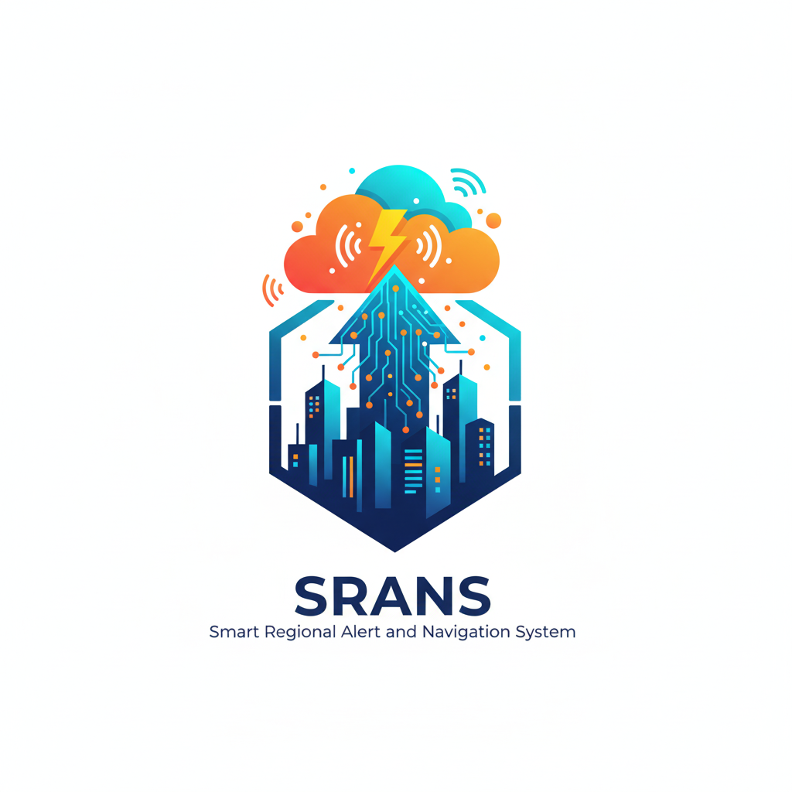
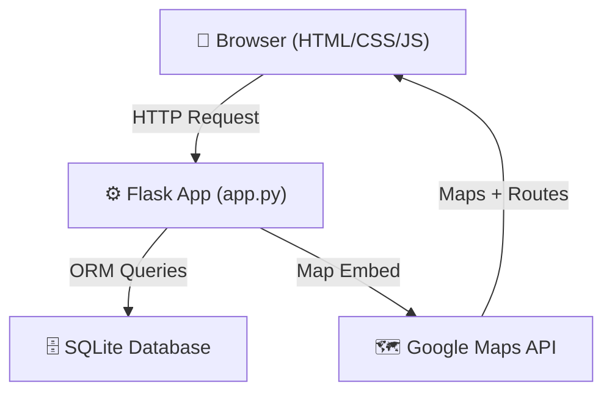
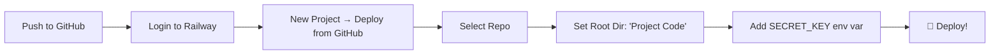
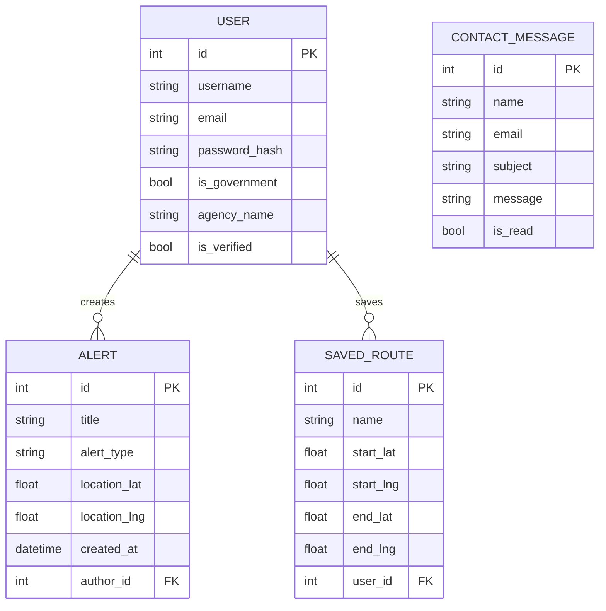

<div align="center">
  
  <h1>SRANS</h1>
  <p><strong>Smart Regional Alert & Navigation System</strong></p>
  <p>Empowering communities with real-time crisis intelligence through location-based alerts and smart navigation.</p>

  [](https://python.org)
  [](https://flask.palletsprojects.com/)
  [](https://railway.app)
  [](LICENSE)
</div>

---

## 🏗️ Architecture



---

## ✨ Key Features

| Feature | Description |
|---|---|
| 🔔 **Live Alerts** | Traffic, Emergency, Weather, Construction, Flood, Health |
| 🗺️ **Smart Navigation** | Google Maps integration with alert overlays and route saving |
| 🏛️ **Dual Roles** | Regular Users + Verified Government Officials |
| 🔐 **Secure Auth** | Werkzeug password hashing + Flask session management |
| 📊 **Admin Dashboard** | Create, edit, delete, and bulk-manage alerts |
| 📬 **Contact System** | Citizens can message government officials directly |

---

## 🚀 Quick Start (Local)

```bash
# 1. Clone the repo
git clone https://github.com/SairajJadhav08/SRANS--Smart-Regional-Alert-and-Navigation-System.git
cd "SRANS--Smart-Regional-Alert-and-Navigation-System/Project Code"

# 2. Create and activate virtual environment
python -m venv venv
# Windows:
venv\Scripts\activate
# macOS/Linux:
source venv/bin/activate

# 3. Install dependencies
pip install -r requirements.txt

# 4. Run the app
python app.py
```

Visit **http://localhost:5000** 🎉

> **Google Maps:** Replace `YOUR_API_KEY` in `templates/map.html` and `templates/index.html` with your key from [Google Cloud Console](https://console.cloud.google.com/).

---

## 🚢 Deploy to Railway



### Step-by-Step

1. **Push your code to GitHub**
2. Go to [railway.app](https://railway.app) → **New Project** → **Deploy from GitHub repo**
3. Select your repository
4. In **Settings → Source**, set **Root Directory** to `Project Code`
5. Add environment variable: `SECRET_KEY` = any random string (e.g. `your-secret-key-here`)
6. Click **Deploy** ✅

> Railway auto-detects Python, uses `requirements.txt` to install deps, and `railway.toml` to start the server.

---

## 🗄️ Database Schema



---

## 👥 Default Test Accounts

| Role | Username | Password |
|---|---|---|
| Government Admin | `admin` | `admin` |
| Regular User | `user` | `user` |

> ⚠️ Change these passwords before going to production!

---

## 📁 Project Structure

```
Project Code/
├── app.py              # Main Flask app (models, routes, auth)
├── requirements.txt    # Python dependencies
├── railway.toml        # Railway deployment config
├── Procfile            # Gunicorn start command
├── runtime.txt         # Python version
├── templates/          # Jinja2 HTML templates
│   ├── base.html       # Base layout (navbar, footer)
│   ├── index.html      # Landing page
│   ├── alerts.html     # Alert listing
│   ├── map.html        # Google Maps integration
│   ├── dashboard.html  # Government admin panel
│   └── ...
└── static/             # Static assets (CSS, images)
```

---

## 🔧 Making Changes

- **Add a new route:** Edit `app.py` → add a `@app.route(...)` function → create a template in `templates/`
- **Add a DB field:** Add the column to the model in `app.py` → delete `instance/database.db` → restart the app to rebuild
- **Change styles:** Edit `templates/base.html` (Tailwind classes) or `static/css/custom.css`
- **Add alert type:** Update the `alert_type` choices in `templates/new_alert.html` and `dashboard.html`

---

## 🛠️ Tech Stack

| Layer | Technology |
|---|---|
| Backend | Python 3.11, Flask 3.0 |
| Database | SQLite + SQLAlchemy ORM |
| Authentication | Werkzeug Security |
| Frontend | Tailwind CSS v3, Jinja2 |
| Maps | Google Maps JavaScript API |
| Deployment | Railway / Gunicorn |

---

## 📝 License

MIT © [Sairaj Jadhav](https://github.com/SairajJadhav08)
