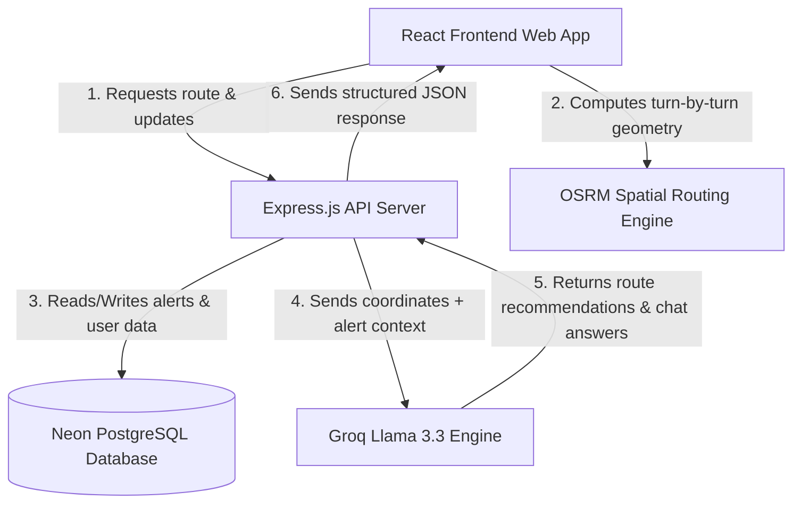
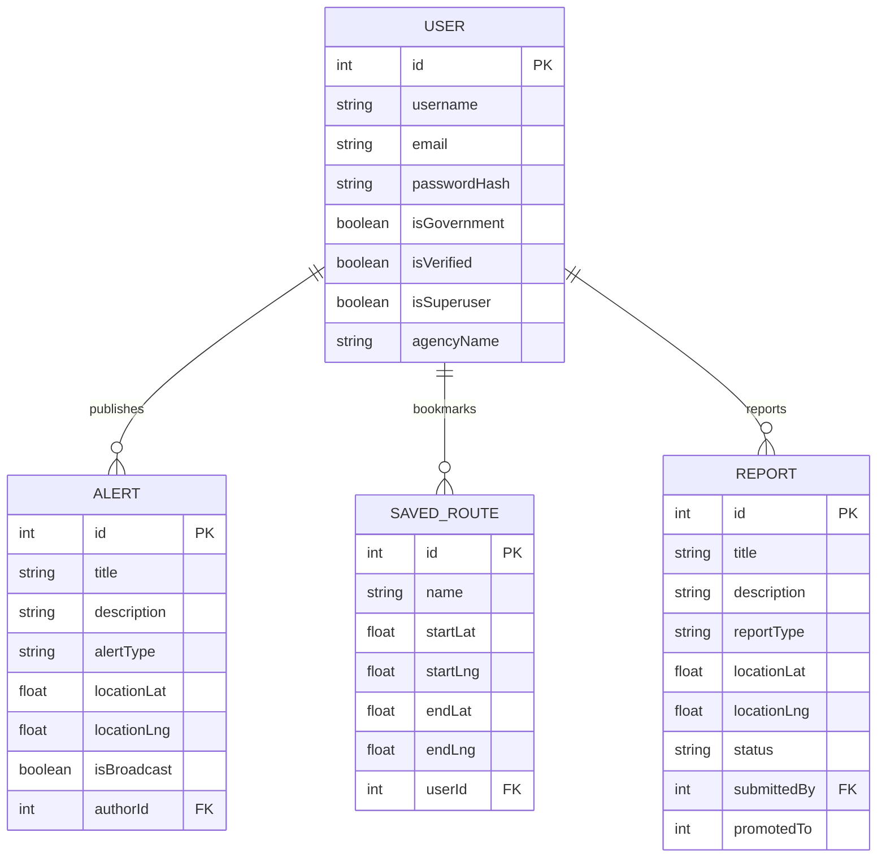

# SRANS – Smart Regional Alert & Navigation System

**🌐 [View Live Application](https://srans-smart-regional-alert-and-navi.vercel.app)** | **📄 [Read the Case Study](docs/case-study.md)** | **⚡ [Live API Portal](https://SairajJadhav08.github.io/SRANS--Smart-Regional-Alert-and-Navigation-System/API_DOCUMENTATION/)**

SRANS is an AI-powered smart navigation platform designed to help commuters avoid traffic congestion and road disruptions caused by government infrastructure projects, public utility work, road maintenance, and natural disasters.

The platform aggregates regional alerts such as road construction, traffic diversions, flooding, and other city-wide incidents to recommend the safest and most efficient route to a user's destination. By proactively identifying affected areas, SRANS minimizes travel delays and improves daily commuting.

---

## 🚀 Key Features

*   **Intelligent Route Optimization**: Dynamic route adjustments based on real-time regional events.
*   **Infrastructure Work Alerts**: Real-time notifications for public utility works, road construction, maintenance, and diversions.
*   **Natural Disaster Warnings**: Instant weather alerts, including regional flooding and environmental disruptions.
*   **Safe Route Recommendations**: Intelligent navigation options that steer you clear of hazardous or heavily congested areas.
*   **Interactive Map Visualization**: Interactive map layouts showing live traffic indicators, user tracking, and active incident flags.
*   **Personalized Commuter Plans**: Save typical route paths and receive custom recommendations before you leave.

### 🤖 AI Features (Powered by Groq API & Llama 3.3)
*   **AI Route Recommendation Engine**: Analyzes live regional alerts, road closures, traffic conditions, and user destinations to generate the safest and fastest alternative route using LLM-powered reasoning.
*   **AI Travel Assistant**: An intelligent conversational assistant that explains traffic conditions, summarizes regional alerts, answers user queries, and provides travel recommendations in natural language, helping users make informed commuting decisions.

---

## 📊 System Architecture Diagram

This simple block diagram illustrates how the frontend navigation client, the Express API backend, and the AI engines interact to compile regional alert updates:


```mermaid
graph TD
    Client[React Frontend Web App]
    Backend[Express.js API Server]
    Database[(Neon PostgreSQL Database)]
    AI[Groq Llama 3.3 Engine]
    OSRM[OSRM Spatial Routing Engine]

    %% Interactions
    Client -- 1. Requests route & updates --> Backend
    Client -- 2. Computes turn-by-turn geometry --> OSRM
    Backend -- 3. Reads/Writes alerts & user data --> Database
    Backend -- 4. Sends coordinates + alert context --> AI
    AI -- 5. Returns route recommendations & chat answers --> Backend
    Backend -- 6. Sends structured JSON response --> Client
```

---

## 🗄️ Database Schema Structure

SRANS uses a relational PostgreSQL database to track users, reports, official alerts, and saved paths:


```mermaid
erDiagram
    USER ||--o{ ALERT : "publishes"
    USER ||--o{ SAVED_ROUTE : "bookmarks"
    USER ||--o{ REPORT : "reports"

    USER {
        int id PK
        string username
        string email
        string passwordHash
        boolean isGovernment
        boolean isVerified
        boolean isSuperuser
        string agencyName
    }
    ALERT {
        int id PK
        string title
        string description
        string alertType
        float locationLat
        float locationLng
        boolean isBroadcast
        int authorId FK
    }
    SAVED_ROUTE {
        int id PK
        string name
        float startLat
        float startLng
        float endLat
        float endLng
        int userId FK
    }
    REPORT {
        int id PK
        string title
        string description
        string reportType
        float locationLat
        float locationLng
        string status
        int submittedBy FK
        int promotedTo
    }
```

---

## 📂 Project Directory Structure

```text
SRANS/
├── README.md                  # This main readme guide
├── API_DOCUMENTATION/         # Dynamic API reference portal
│   ├── index.html             # Premium Dark Mode API browser UI
│   └── openapi.yaml           # Full OpenAPI v3.0 REST Specification
│
├── docs/                      # Architectural designs and case studies
│   ├── case-study.md          # Comprehensive Engineering Case Study
│   ├── api-design.md          # Detailed endpoints breakdown for devs
│   └── screenshots/           # Application layout images directory
│
├── backend/                   # Node.js + Express + TypeScript + Prisma API
├── frontend/                  # React + TypeScript + Vite + Leaflet Web Application
└── Project-Code/              # Original Python + Flask Prototype Codebase
```

---

## 🛠️ Quick Installation & Setup

### Prerequisites
*   Node.js (v18+)
*   PostgreSQL instance (e.g., [Neon](https://neon.tech/))
*   Groq API Key (from [console.groq.com](https://console.groq.com/))

### 1. Backend Server Setup
1. Enter backend folder and install modules:
   ```bash
   cd backend
   npm install
   ```
2. Copy configuration variables:
   ```bash
   cp .env.example .env
   ```
   *Fill in your database URL, JWT secret, and Groq API token inside the newly created `.env` file.*
3. Initialize the database and seed the system:
   ```bash
   npm run db:push
   npm run db:generate
   npx tsx seed-ai-user.ts
   ```
4. Boot development server:
   ```bash
   npm run dev
   ```

### 2. Frontend Web App Setup
1. Enter frontend folder and install modules:
   ```bash
   cd ../frontend
   npm install
   ```
2. Set API endpoints:
   ```bash
   cp .env.sample .env
   ```
   *Make sure `VITE_API_URL` points to your backend (default is `http://localhost:5000/api`).*
3. Boot development web client:
   ```bash
   npm run dev
   ```
   *Open `http://localhost:5173` in your browser.*

---

## 📄 License

This project is licensed under the MIT License.

---

<!-- Mermaid JS support for live docs rendering -->
<script type="module">
  import mermaid from 'https://cdn.jsdelivr.net/npm/mermaid@10/dist/mermaid.esm.min.mjs';
  mermaid.initialize({ startOnLoad: false });
  
  const convertBlocks = async () => {
    // Find all blocks representing mermaid diagrams
    const blocks = document.querySelectorAll(
      'pre code.language-mermaid, pre.language-mermaid, div.language-mermaid pre, code.language-mermaid'
    );
    
    for (const block of blocks) {
      const code = block.textContent.trim();
      const container = block.closest('.language-mermaid') || block.closest('pre') || block;
      
      const newDiv = document.createElement('div');
      newDiv.className = 'mermaid';
      newDiv.textContent = code;
      
      container.parentNode.replaceChild(newDiv, container);
    }
    
    await mermaid.run();
  };

  if (document.readyState === 'loading') {
    document.addEventListener('DOMContentLoaded', convertBlocks);
  } else {
    convertBlocks();
  }
</script>

