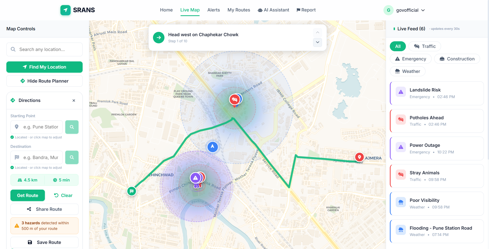
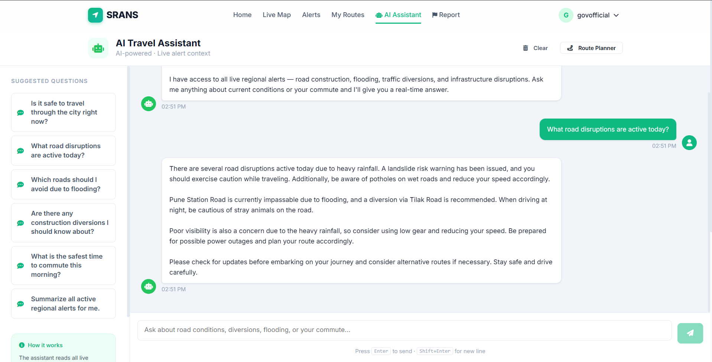
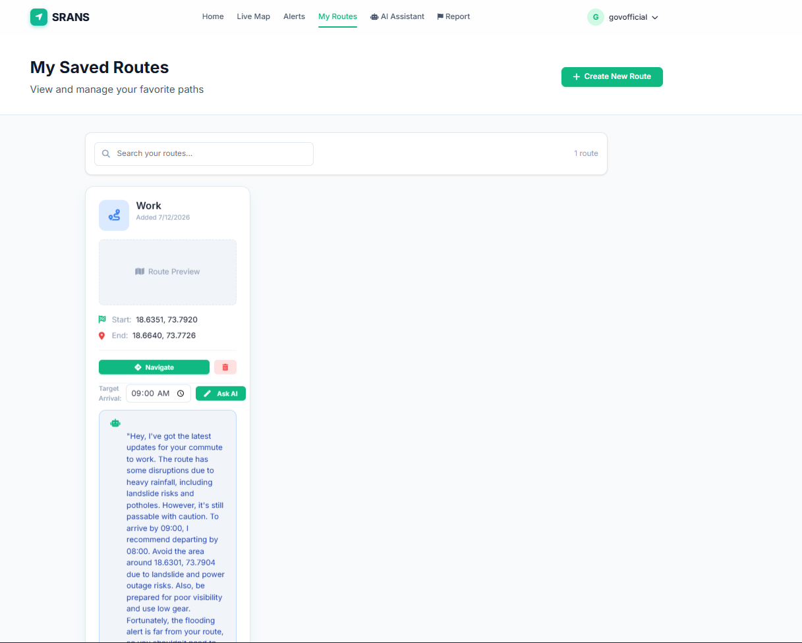
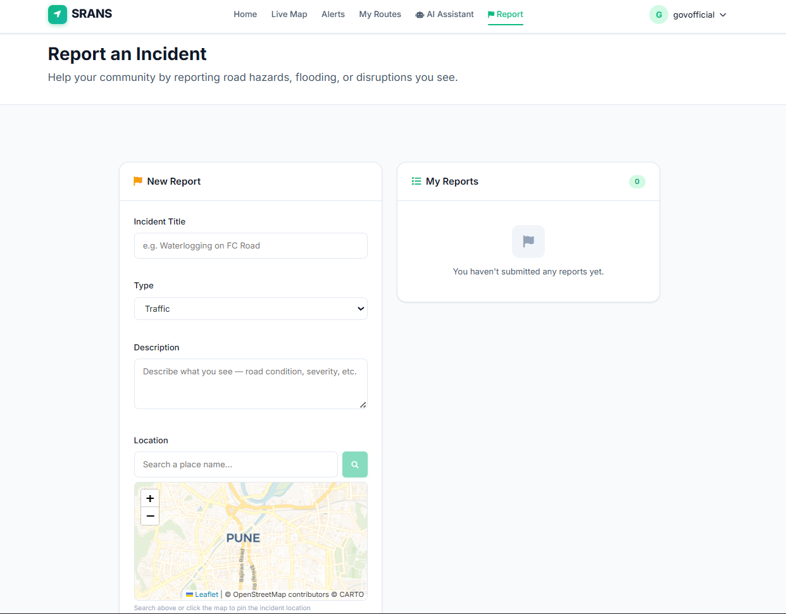
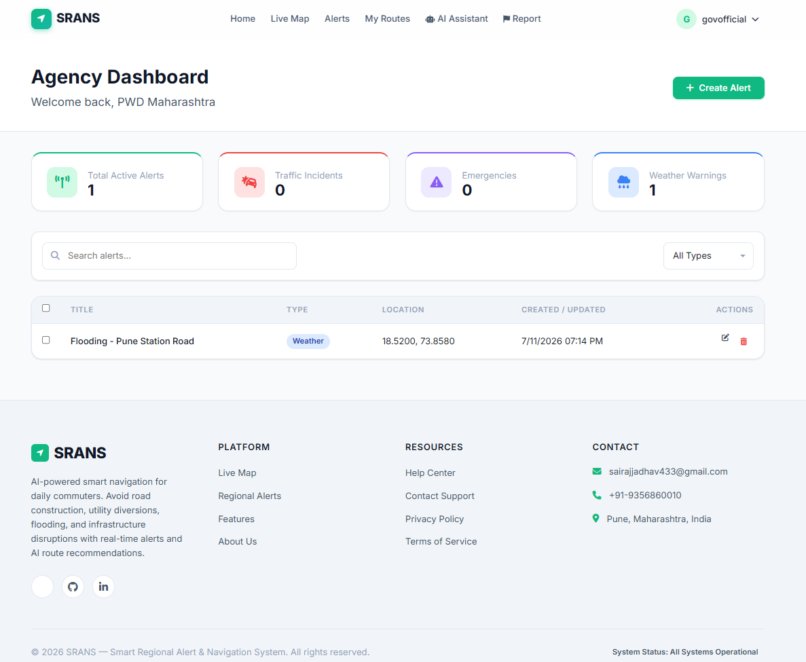
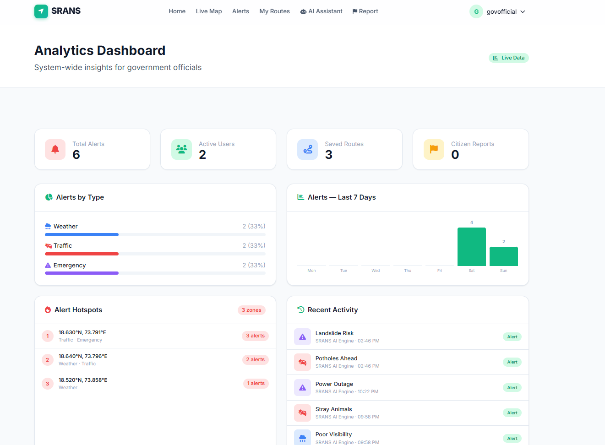
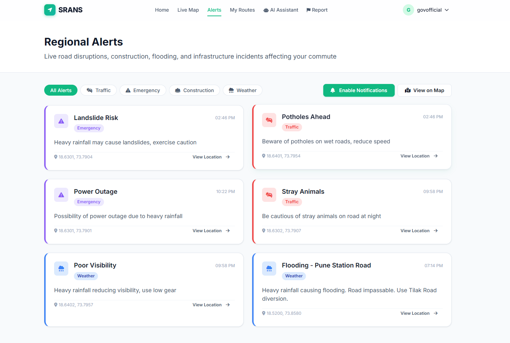
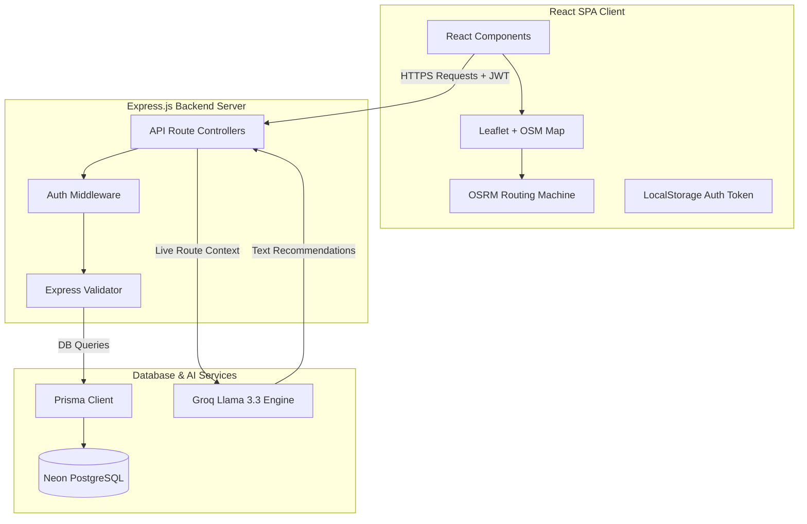
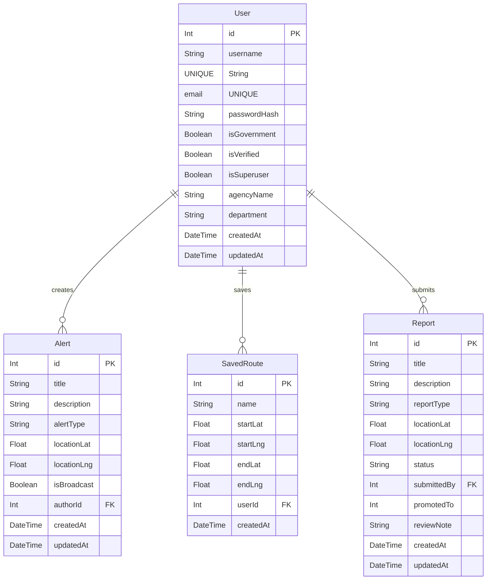
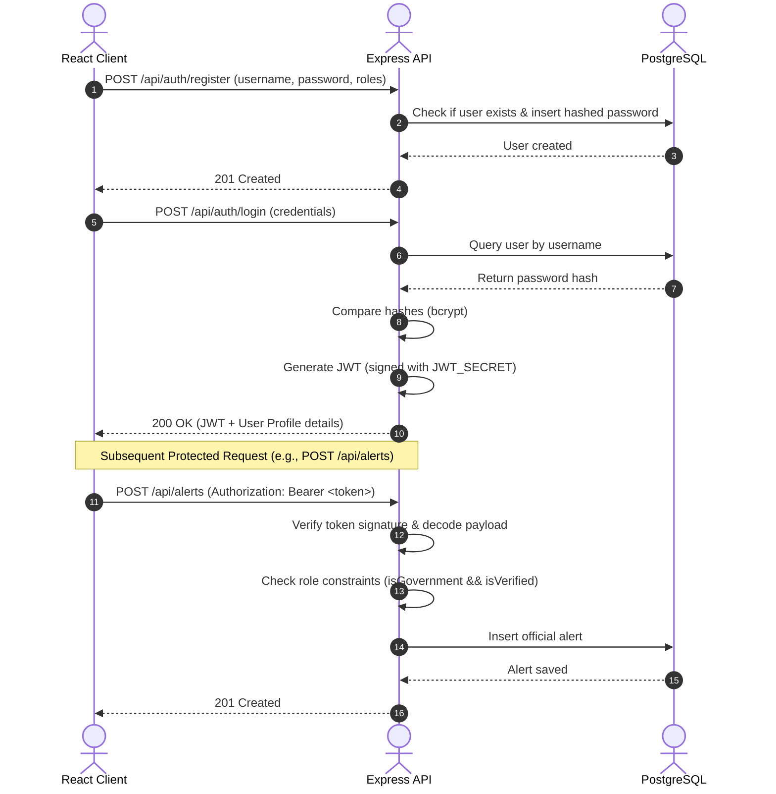

# Engineering Case Study: Smart Regional Alert & Navigation System (SRANS)

**🌐 [View Live Application](https://srans-smart-regional-alert-and-navi.vercel.app)** | **⚡ [Live API Portal](https://SairajJadhav08.github.io/SRANS--Smart-Regional-Alert-and-Navigation-System/API_DOCUMENTATION/)** | **🏠 [Back to Main Readme](../README.md)**

This document provides a detailed overview of the SRANS architecture, engineering design choices, database structures, and development challenges.

---

## 1. Overview

**SRANS (Smart Regional Alert & Navigation System)** is a web-based, real-time spatial routing and alert dashboard. It enables citizens and regional government authorities to collaborate on regional travel hazards, road disruptions, and emergency broadcasts. 

Built using a modern decoupled architecture, SRANS incorporates an **Express.js + TypeScript** API, a **React + Vite** frontend, and a **Neon PostgreSQL** serverless database. In addition, it employs the **Groq API** (`llama-3.3-70b-versatile`) to deliver specialized, context-aware navigational guidance, automated hazard predictions, and interactive driving copilots.

---

## 2. Problem Statement

Regional transportation networks suffer from a lack of real-time communication between commuters on the road and local municipal authorities. This leads to several critical inefficiencies:
1. **Delayed Danger Warnings**: Drivers lack immediate knowledge of emergency conditions, localized flooding, utility blocks, or sudden construction zones.
2. **Static Navigation Routes**: Traditional navigation apps map routes based on distance or general highway speed, but ignore micro-hazards like regional waterlogging, small-scale construction delays, or time-of-day traffic bottlenecks.
3. **Low Authority Visibility**: Municipal and regional agencies lack an integrated portal to publish official hazard alerts, verify crowdsourced citizen reports, or broadcast critical evacuation warnings instantly.
4. **Information Overload**: Commuters are forced to parse multiple feeds (weather reports, news feeds, navigation maps) manually to plan safe travel.

---

## 3. Solution

SRANS bridges this gap by creating a unified spatial platform featuring:
*   **Crowdsourced Citizen Reporting**: Citizens report micro-hazards directly on an interactive map.
*   **Verified Official Promotion**: Regional government officers review and promote citizen reports to official status.
*   **Decoupled spatial routing engine**: Leaflet + OSM maps utilizing the Open Source Routing Machine (OSRM) for turn-by-turn navigation.
*   **Generative AI Commuter Intelligence**: A multi-faceted LLM copilot that digests nearby alerts and route vectors to write concise travel recommendations, run interactive navigation chats, and predict localized road hazards dynamically.

---

## 4. Features

### Core Capabilities
*   **Spatial Alert Map**: Category-based filtering (Traffic, Emergency, Construction, Weather) using Leaflet.
*   **Evacuation & Emergency Broadcasts**: Superusers can issue a global critical alert shown immediately to all connected browsers.
*   **Role-Based Access Control (RBAC)**: Distinct permissions for Citizens, Government Officers (who must be approved by an Admin), and Superusers.
*   **Commute Routine Planner**: Custom trip planner that alerts commuters about hazards along their regular route and estimates ideal departure times.
*   **Spatial AI Co-pilot**: An AI chatbot that receives the live coordinates of the current path and actively guides the driver.

---

## 5. Tech Stack

| Component | Technology | Rationale |
| :--- | :--- | :--- |
| **Frontend UI** | React v18, TypeScript, Vite | Fast build cycles, component reusability, and strong compile-time type safety. |
| **Frontend Map** | Leaflet, Leaflet Routing Machine | Lightweight, open-source mapping engine. Free from expensive commercial API limits (e.g., Google Maps). |
| **Backend API** | Express.js (v5), TypeScript | Asynchronous performance, extensive middleware library, and unified language stack. |
| **Database** | PostgreSQL via Neon | Serverless SQL database offering autoscaling, point-in-time recovery, and instant branching. |
| **ORM** | Prisma (v7) | Type-safe queries, auto-generated TypeScript clients, and declarations matching schema models. |
| **AI LLM** | Groq SDK (`llama-3.3-70b-versatile`) | Ultra-low latency inference, enabling real-time navigation copilot responses. |
| **Authentication** | JSON Web Tokens (JWT) & bcryptjs | Stateless, secure, signature-verified user session tracking. |

---

## 6. Screenshots

### Interface Previews

#### 1. Interactive Navigation Map
Displays real-time Leaflet maps, custom travel routes, location overlays, and active hazard coordinates.

#### 2. AI Travel Assistant
An interactive, natural-language conversational co-pilot answering query tickets using contextual live alerts database logs.

#### 3. Saved Routes & AI Planner
Enables citizens to save recurring journeys and queries Llama 3.3 for departure warnings and hazard avoidance recommendations.

#### 4. Citizen Incident Reporting
A simplified portal for commuters to log localized hazards on the map.

#### 5. Government Alerts Dashboard
Administrative dashboard for traffic officers to create, edit, bulk-delete, and push broadcast alerts.

#### 6. Government Incident Analytics
Visualized statistics on hazard types, frequency hotspots, and incident reports.

#### 7. Active Alerts Feed
A clean list of all traffic, weather, emergency, and construction notifications.

---

## 7. Architecture Diagram

The system employs a client-server architecture. Spatial routing is computed client-side using OSRM, whereas user data, alerts, reports, and AI reasoning are resolved on the Express API server.

---

## 8. Database Schema (ER Diagram)

The database schema manages relational connections between users, official alerts, saved commuter routes, and crowdsourced reports.

---

## 9. Authentication Flow

SRANS uses stateless JWT-based authentication. The token encapsulates user permissions, enforcing Role-Based Access Control (RBAC) across endpoints.

---

## 10. Challenges Faced

### 1. Leaflet State Synchronizations
*   **The Issue**: React re-renders component elements frequently. This caused Leaflet map markers to re-initialize and flash, or the map to lose zoom levels whenever new live alerts were polled in the background.
*   **Solution**: Moved maps and routing initializations into custom React `useRef` states. We decoupled map updates from typical state cycles and used raw Leaflet commands (e.g., `marker.addTo()`) within scoped `useEffect` hooks triggered strictly by dataset changes.

### 2. CORS and Auth Headers
*   **The Issue**: During local development, the React frontend (`localhost:5173`) and Express backend (`localhost:5000`) triggered CORS blocks when attempting credential transfers.
*   **Solution**: Implemented explicit CORS middleware in Express with dynamic origin validation, allowing credentials and verifying standard `Authorization` headers.

### 3. Parse-Safe LLM JSON Outputs
*   **The Issue**: When using Groq AI for automated hazard detection (`/detect-alerts`), Llama 3.3 occasionally output conversational preamble (e.g., *"Here is the JSON you requested..."*) surrounding the array, causing syntax errors during `JSON.parse`.
*   **Solution**: Used strict system prompting instructions combined with regex arrays extraction (`raw.match(/\[[\s\S]*\]/)`) to clean raw text and isolate the JSON array before parsing.

### 4. Background Alert Notifications
*   **The Issue**: Users needed to be notified of emergency broadcasts even if they were viewing a different tab.
*   **Solution**: Added a background poll event listener to `App.tsx` matching stored notification pointers (`srans_last_alert_id`) in `localStorage` to trigger native HTML5 browser notification prompts safely.

---

## 11. Future Improvements

1.  **Websockets for Instant Evacuations**: Implement Socket.io to push emergency alerts and superuser broadcasts instantaneously to all connected screens without HTTP polling.
2.  **Offline Map Caching**: Cache Leaflet tile layers locally using Service Workers to allow maps to remain visible in low-bandwidth regional transit corridors.
3.  **Crowdsourced Spam Detection**: Build automated spatial clustering rules (e.g., DB-Scan) that check if multiple users are reporting similar incidents in close proximity to confirm incident severity and filter out spam.
4.  **AI Route Re-routing Engine**: Link OSRM routing waypoints directly to the LLM context, permitting the AI to automatically construct alternative Leaflet coordinate vectors and redirect drivers directly on the map.

---

## 12. GitHub Repository

- **Organization**: SRANS Open Source Project
- **Main Repository**: `SRANS--Smart-Regional-Alert-and-Navigation-System`
- **Development Branches**:
  - `main`: Production-ready service deployable to Vercel/Render.
  - `backend`: Backend API development and Prisma migrations.
  - `frontend`: React app design, map integrations, and custom CSS styling.

---

<!-- Mermaid JS support for live docs rendering -->

